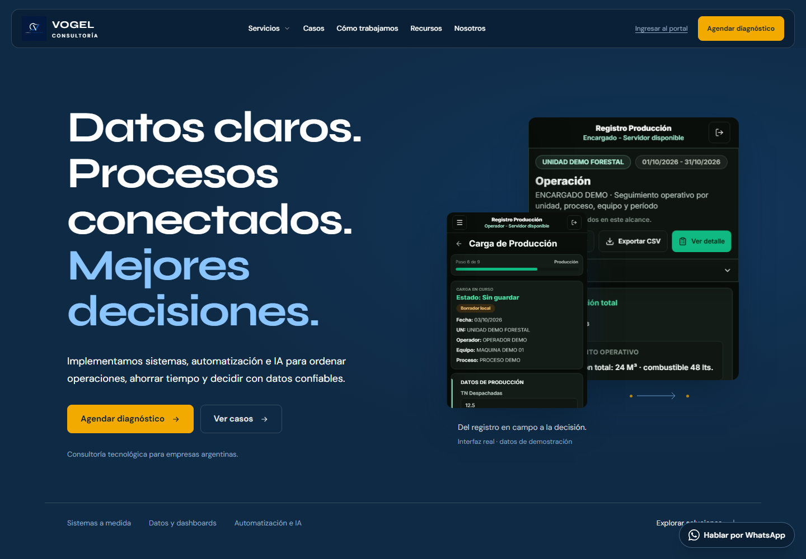
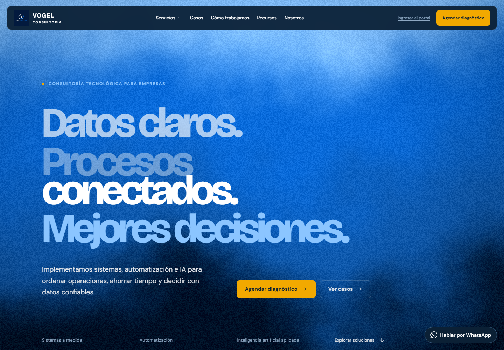
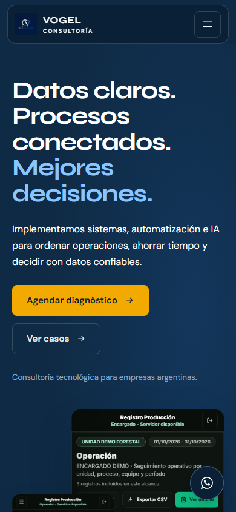
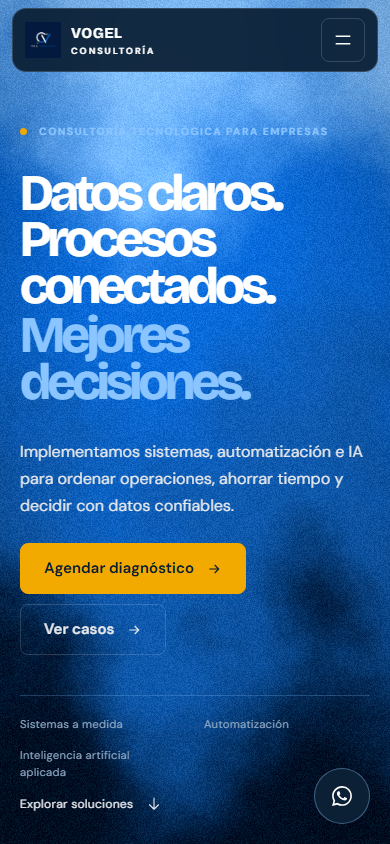

# Comparación visual — Vogel Consultoría

Capturas archivadas el 2026-10-03 para revisión del rediseño local. La base inicial diferencia el sitio publicado de la copia local anterior a esta iteración; la vista final corresponde al código local y no está publicada.

## Escritorio — 1440 × 1000

| Publicado al iniciar | Clon local al iniciar | Rediseño local |
|---|---|---|
|  |  |  |

## Móvil — 390 × 844

| Publicado al iniciar | Clon local al iniciar | Rediseño local |
|---|---|---|
|  |  |  |

La vista publicada inicial de móvil también está en [publicada-movil.png](capturas/fase-inicial-2026-10-03/publicada-movil.png). El recorrido completo publicado, comparado con el recorrido final en movimiento reducido, está en [publicada-recorrido-completo.png](capturas/fase-inicial-2026-10-03/publicada-recorrido-completo.png) y [inicio-escritorio-completo-reduced-motion.png](capturas/fase-final-2026-10-03/inicio-escritorio-completo-reduced-motion.png).

La comparación muestra la composición y jerarquía observadas en cada etapa; el contenido publicado y el clon inicial ya tenían diferencias documentadas en [estado-inicial-sitio-2026-10-03.md](estado-inicial-sitio-2026-10-03.md). No implica equivalencia de contenido, campañas o comportamiento entre producción y el entorno local.
